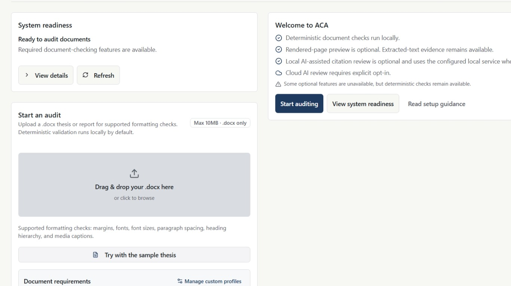
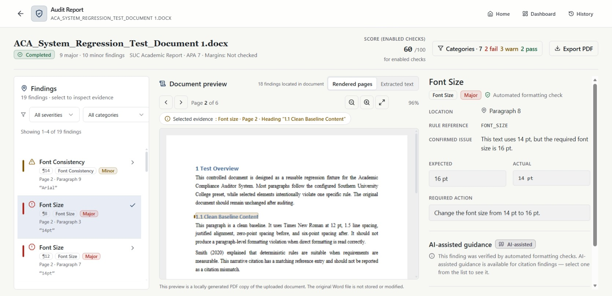

# Academic Compliance Auditor

Academic Compliance Auditor (ACA) is a Windows application that reviews academic DOCX documents for formatting and APA 7 citation issues. All checks run locally on your machine. Findings are guidance for your own review — ACA does not guarantee institutional acceptance or complete academic compliance.

## Download

Academic Compliance Auditor is currently distributed privately for evaluation.

Installer: `AcademicComplianceAuditor-Setup-1.0.0.exe`

Obtain it from:

- the project owner, or
- the approved university submission or evaluation channel

Please note:

- A public download page is not currently available.
- The installer is unsigned, so Windows may display an *Unknown publisher* or SmartScreen warning. See [Troubleshooting](docs/TROUBLESHOOTING.md).

## Quick Start

1. Obtain the Windows installer from the project owner or your approved evaluation channel.
2. Double-click the Setup EXE.
3. Complete the installation — per-user, no administrator rights needed.
4. Open ACA from the Windows Start Menu.
5. Upload a DOCX document or use the sample document.
6. Review findings and export the PDF report.

Python and Node.js are not required.

## Review Findings with Page Evidence

After an audit, ACA shows what it found and why:

- Identifies supported formatting and citation issues, grouped by severity.
- Shows the required value and the value found in your document (Expected and Actual).
- Links each finding to evidence — a rendered page preview when the optional LibreOffice integration is available, or the extracted text otherwise.
- Produces a PDF report you can save or share.

## Optional Features

Two optional components extend ACA, but neither is required:

- **LibreOffice** enables rendered-page previews and original-document page locations. Without it, extracted-text evidence remains available.
- **Ollama** enables optional local AI citation guidance. Without it, deterministic checks are unaffected.

Core deterministic audits remain available without either component. When an optional component is missing, setup actions appear in the Dashboard's **System Readiness** card — ACA never downloads or installs third-party software itself.

## Documentation

**User documentation**

- [Installation](docs/INSTALLATION.md)
- [User Guide](docs/USER_GUIDE.md)
- [Troubleshooting](docs/TROUBLESHOOTING.md)
- [Privacy](docs/PRIVACY.md)
- [Known Limitations](docs/KNOWN_LIMITATIONS.md)

**Developer documentation**

- [Developer Setup](docs/developer/DEVELOPER_SETUP.md)
- [Build and Release](docs/developer/BUILD_AND_RELEASE.md)
- [Technical Troubleshooting](docs/developer/TECHNICAL_TROUBLESHOOTING.md)

**Evaluation documentation** (for the project owner and evaluators)

- [Release Checklist](docs/evaluation/RELEASE_CHECKLIST.md)
- [End-User Installation Test](docs/evaluation/END_USER_INSTALLATION_TEST.md)

**Other**

- [Third-Party Notices](THIRD_PARTY_NOTICES.md)

## License Status

No project software license has been selected. ACA remains All rights reserved.
